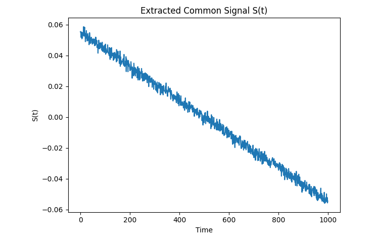
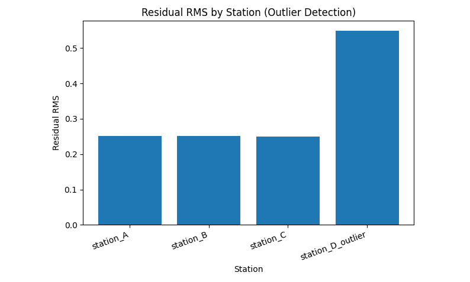
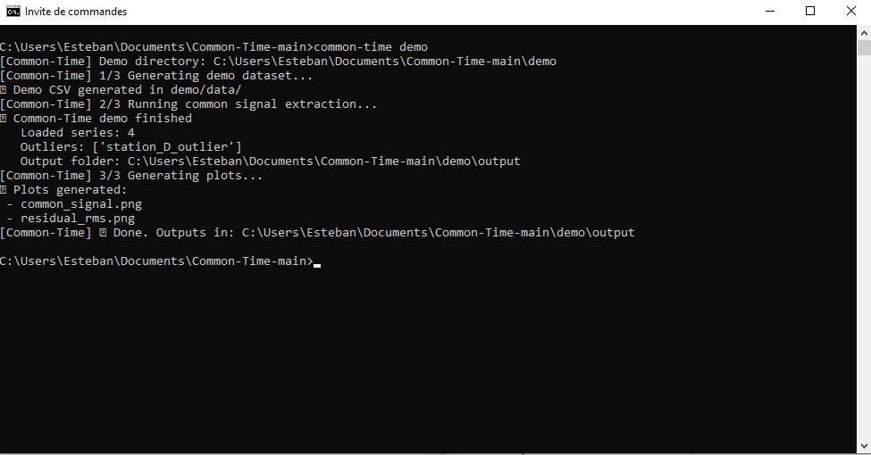

# Common-Time

Common-Time is an analysis tool designed to extract a **robust common temporal signal**
from multiple time series and to isolate **local anomalies** in distributed systems.

The project focuses on **slow drift detection** in critical multi-source environments
such as ground stations and distributed infrastructures.

---

## What problem does it solve?

When several systems drift simultaneously, standard monitoring tools
cannot easily distinguish:
- a **global drift** (infrastructure, reference clock, network)
- from **local faults** (single station or sensor failure)

This leads to false alarms, delayed diagnostics, and incorrect corrective actions.

---

## What Common-Time does

Common-Time:
- ingests multiple heterogeneous time series
- extracts a **shared slow signal** common to all sources
- separates global behavior from station-specific residuals
- highlights anomalous sources automatically

---

## Demonstration outputs

The following outputs are generated automatically from a single command
on a synthetic multi-station dataset.

*Extracted slow common drift shared by all stations.*

*Residual energy per station. The faulty station is clearly isolated.*

*One-command execution of the Common-Time demo.*

---

## Status

- Type: functional prototype  
- Maturity: validated internal demo  
- Distribution: demonstration-only (engine not public)

---

## Contact

For evaluation, partnership, or incubator programs:  
📧 contact@ervra.tech
